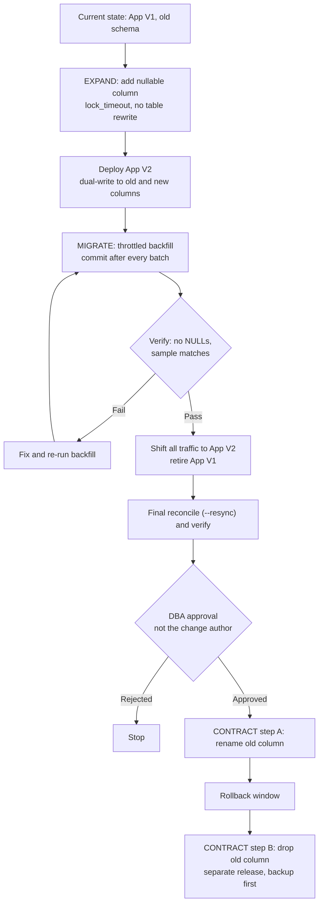

# Database Migration Flow

```mermaid
flowchart TD
    A["Current state: App V1, old schema"] --> B["EXPAND: add nullable column<br/>lock_timeout, no table rewrite"]
    B --> C["Deploy App V2<br/>dual-write to old and new columns"]
    C --> D["MIGRATE: throttled backfill<br/>commit after every batch"]
    D --> E{"Verify: no NULLs,<br/>sample matches"}
    E -->|Fail| F["Fix and re-run backfill"]
    F --> D
    E -->|Pass| G["Shift all traffic to App V2<br/>retire App V1"]
    G --> H["Final reconcile (--resync) and verify"]
    H --> I{"DBA approval<br/>not the change author"}
    I -->|Rejected| M["Stop"]
    I -->|Approved| J["CONTRACT step A: rename old column"]
    J --> K["Rollback window"]
    K --> L["CONTRACT step B: drop old column<br/>separate release, backup first"]
```

CONTRACT is a separate deployment and always needs DBA approval.
